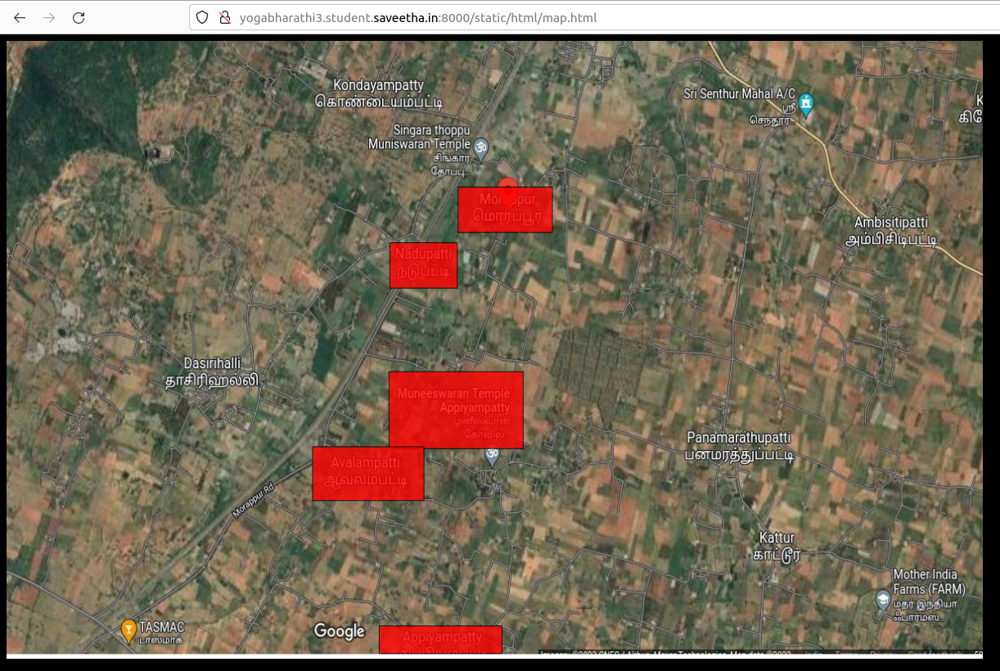
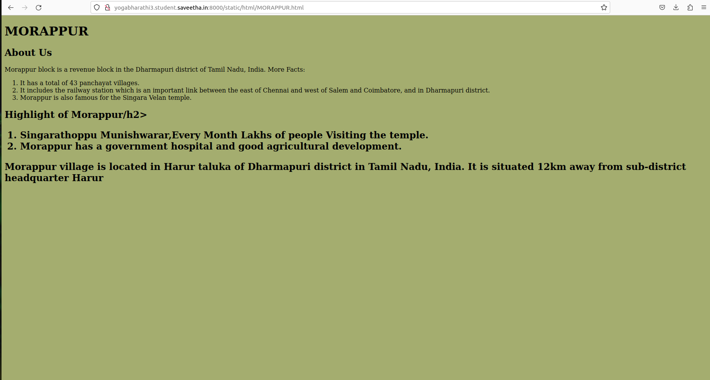
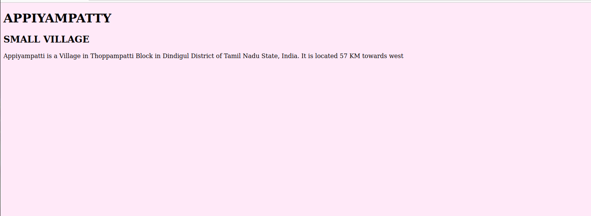
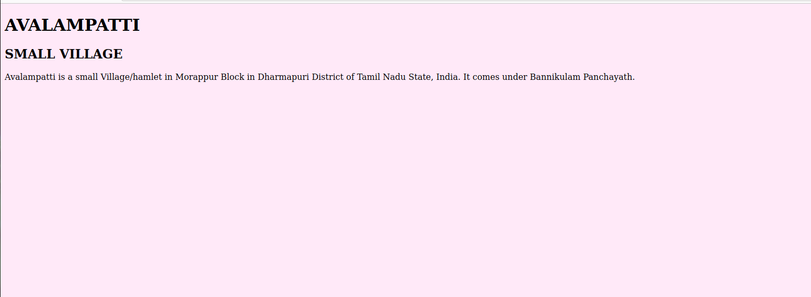
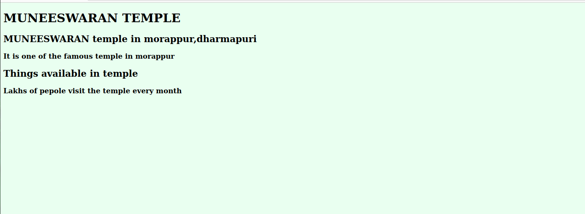
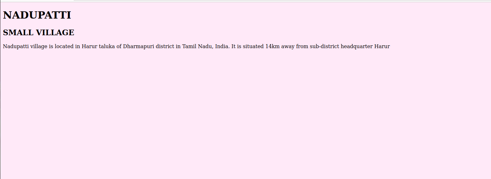

# Places Around Me
## AIM:
To develop a website to display details about the places around my house.

## Design Steps:

### Step 1:
Take screenshots of places around your house using Google Maps.
### Step 2:
Identify a minimum of five different locations and mark them using image maps.
### Step 3:
Develop a webpage(minimum of 50 words) for each location and link it to the image region.
## Code:
MAP
```
<!DOCTYPE html>
<html lang="en">
<head>
  <title> MORAPPUR MAP </title>
</head>
<body style="background-color: black;">
    
<MAP name="morappur map">
<area  alt="MORAPPUR" title="MORAPPUR" href="/MORAPPUR/"> shape="rect" coords="1083,459,1200,509" 
<area  alt="MUNEESWARAN TEMPLE" title="MUNEESWARAN TEMPLE" href="/MUNEESWARAN TEMPLE/"> shape="rect" coords="998,658,1164,742" 
<area  alt="AVALAMPATTI"title="AVALAMPATTI" href= "/AVALAMPATTI/"> shape="rect" coords="904,739,1042,798" 
<area  alt="APPIYAMPATTY" title="APPIYAMPATTY" href="/APPIYAMPATTY/"> shape="rect" coords="986,932,1138,963" 
<area  alt="NADUPATTI" title="NADUPATTI" href= "/NADUPATTI/"> shape="rect" coords="999,519,1083,569" 

</map>
</body>
</html>
```
MORAPPUR
```
<!DOCTYPE html>
<html lang="en">
<head>
  <title> MOARPPUR </title>
</head>
<body style="background-color: rgba(147, 158, 83, 0.836);">

<h1>MORAPPUR</h1>


<h2>About Us</h2>
<p>
Morappur block is a revenue block in the Dharmapuri district of Tamil Nadu, India.

More Facts:
<ol>
<li> It has a total of 43 panchayat villages.</li>
 <li> It includes the railway station which is an important link between the east of Chennai and west of Salem and Coimbatore, and in Dharmapuri district.</li>
<li> Morappur is also famous for the Singara Velan temple.</li>
</ol>
<h2>Highlight of Morappur/h2>
<ol>
    <li>Singarathoppu Munishwarar,Every Month Lakhs of people Visiting the temple.</li>
    <li>Morappur has a government hospital and good agricultural development.</li>
    


</ol>

<P>Morappur village is located in Harur taluka of Dharmapuri district in Tamil Nadu, India. It is situated 12km away from sub-district headquarter Harur</p>


</body>
</html>
```
APPITYAMPATTY
```
<!DOCTYPE html>
<html lang="en">
<head>
  <title> APPIYAMAPATTY </title>
</head>
<body style="background-color: #FFE9F8;">

<h1> APPIYAMPATTY </h1>
<h2>SMALL VILLAGE</h2>
<p>Appiyampatti is a Village in Thoppampatti Block in Dindigul District of Tamil Nadu State, India. It is located 57 KM towards west</p>
</body>
</html>
```
AVALAMPATTI
```
<!DOCTYPE html>
<html lang="en">
<head>
  <title> AVALAMPATTI </title>
</head>
<body style="background-color: #FFE9F8;">

<h1> AVALAMPATTI </h1>
<h2>SMALL VILLAGE</h2>
<p>Avalampatti is a small Village/hamlet in Morappur Block in Dharmapuri District of Tamil Nadu State, India. It comes under Bannikulam Panchayath.</p>

</body>
</html>
```
MUNEESWARAN TEMPLE
```
<!DOCTYPE html>
<html lang="en">
<head>
  <title> MUNEESWARAN TEMPLE </title>
</head>
<body style="background-color: #E9FFF0;">

<h1> MUNEESWARAN TEMPLE </h1>
<h2>MUNEESWARAN temple in morappur,dharmapuri</h2>

<h3>It is one of the famous temple in morappur</h3>
<h2>Things available in temple</h2>

<h3>Lakhs of pepole visit the temple every month</h3>
</html>
```
NADUPATTI
```
<!DOCTYPE html>
<html lang="en">
<head>
  <title> NADUPATTI </title>
</head>
<body style="background-color: #FFE9F8;">

<h1> NADUPATTI </h1>
<h2>SMALL VILLAGE</h2>
<p>Nadupatti village is located in Harur taluka of Dharmapuri district in Tamil Nadu, India. It is situated 14km away from sub-district headquarter Harur</p>
</body>
</html>
```

## Output:







## Result:
Successfully developed a webpage for each location and linked it to the image region.